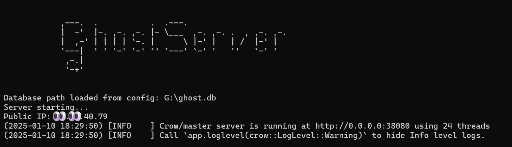

# Welcome to the GhostServer!

This is the server-side of the GhostStream project. The soul.

## What do you need?
You will need some packages. I used VCPKG, because this project was developed in VS 2022. You can use it too, or just install the packages manually.

- sqlite3
- crow
- nlohmann-json
- jwt-cpp
- openssl
- picojson
- curl

## Let's talk about IPs
Yeah, I have DDNS too. The solution I found is pretty simple: DuckDNS.
With DuckDNS, the client will always being able to reach the server, no matter what public IP has the server
right now.

Just create a domain, download the agent to keep it updated and hardcode the domain in the config JSON. That's it.

## Initialize the server

### Step 1: Where to store the media
First of all, you need a path to store the media. I recommend a new partition, or a new SSD.
In this path, you will store:
- Media covers
- Media chunks
- Media subtitles
- Server database

About media chunks, this server streams with DASH protocol. So, we don't need the actual media file, just the chunks. 
Anyway, keep in mind that this server will use a lot of space, depending on the amount of media you have.

Of course, we both know that you will not store any pirated media, just the record of the wedding of your cousin.

Do you have the path? Great! Let's move on.

### Step 2: Initialize the database
This server uses a SQLite3 database. To create it, just run the *init.py* script in the selected path.
This script will create the database and the tables.

### Step 3: Adding users
What is an user? It is not a profile like a Netflix user. An user is a client that will connect with the server, and have multiple profiles.

The *add_user.py* file is for this. For each user (**not profile**) you want to add, run this script with --user and --token parameters.
The token can be anything, you will have to decide one, and share it with the user. It will serve to authenticate the user and he will be able to get the JWT tokens.

That's it.

### Step 4: Run the server
Run the executable. It is stored in the /Build/ folder. The server uses the port 38080, keep that in mind. Also, remember to update the *config.json* paths.
As long as this executable is running, the server will be available to the clients.

I think that's all. If you have any questions, feel free to ask to my email.

## Add your absolutely not pirated media
I (claude really) made a cute GUI that adds the media to the database. This are the steps:
1. IMDb info and cover is downloaded
2. Media info is added to the database
3. Media file is splitted into streameable chunks

So, tecnically, we don't "add" any media. We just copy it in a chunky format and download some metadata. 

Important, as requisite, you will need an api key from http://www.omdbapi.com/. This key is used to download the IMDb info, and can be setted in the GUI.

In the GUI, you will see that there are three types of media: Standalone movies (Titanic, The Prestige), movies from a collection (Harry Potter, Star Wars) and TV Shows (Breaking Bad, Game of Thrones).
Each type has its own way to be added.

For standalone movies, you just need the IMDb URL of the movie. Just that.

For movies from a collection, you need the IMDb URL of each of the movies in the collection. But, there is no IMDb page for the collection itself. So, you will have to fill some custom data.

For TV Shows, you need the IMDb URL of the show. Optionally, you can add the IMDb URL of the episodes.

That's it. The GUI will do the rest. Just press the button and wait a bit!

## TODO and improvements
- Update the exposed IP automatically if DDNS changes it
- For now, only english and spanish subs are available. Add more languages
- Better add-media script maybe